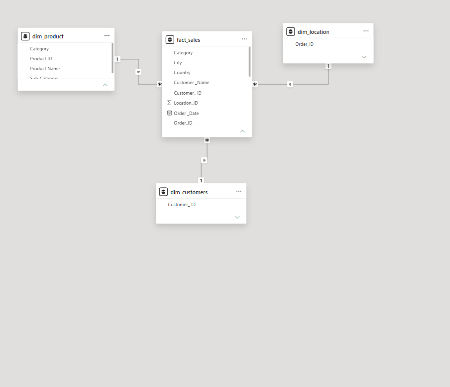
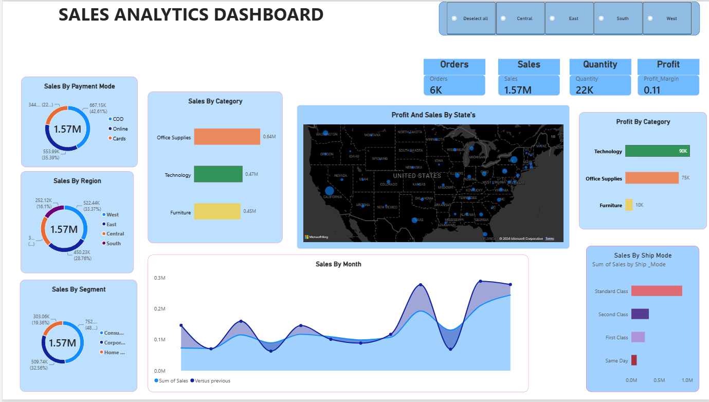
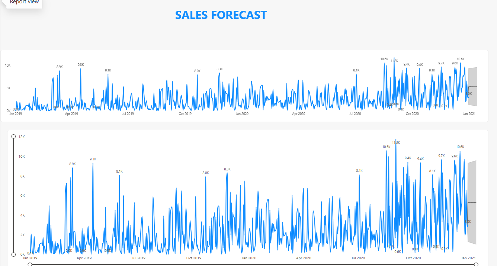

# 📊 Sales Analytics Dashboard

An interactive **Sales Analytics Dashboard** built using **Microsoft Power BI** to analyze sales performance, profitability, customer segments, product categories, regions, payment methods, and shipping modes.

The project also includes a **sales forecasting analysis** to understand potential future sales trends.

---

## 🎯 Project Objective

The objective of this project is to transform raw sales data into an interactive dashboard that helps identify:

- Overall sales and order performance
- Most profitable product categories
- Regional and state-level performance
- Sales trends over time
- Customer segment contribution
- Payment method distribution
- Shipping mode performance
- Future sales trends through forecasting

---

## 🛠️ Tools & Technologies

- **Power BI**
- **Power Query**
- **DAX**
- **Microsoft Excel**
- **Data Modeling**
- **Data Visualization**

---

## 📂 Dataset

The dataset contains sales transaction information including:

- Order details
- Product information
- Customer information
- Location information
- Sales
- Quantity
- Profit
- Payment mode
- Shipping mode
- Order dates

---

## 🧹 Data Preparation

The data was prepared using Power Query and Power BI.

Key steps included:

- Data cleaning
- Removing inconsistencies
- Data type transformation
- Creating dimension tables
- Creating relationships
- Preparing data for analysis
- Creating calculated measures using DAX

---

## 🗂️ Data Model

The project uses a structured data model with a central **Fact Sales** table connected to dimension tables such as:

- `dim_product`
- `dim_customers`
- `dim_location`

This structure helps organize the data and enables efficient analysis across different business dimensions.

### Data Model

---

## 📊 Dashboard

The main dashboard provides an overview of sales performance with interactive filtering by region.

### Key KPIs

- **Orders:** 6K
- **Sales:** 1.57M
- **Quantity:** 22K
- **Profit Margin:** 0.11

### Dashboard Preview

---

## 📈 Sales Forecast

A separate report page was created to analyze historical sales trends and forecast potential future sales.

---

## 🔍 Key Insights

The dashboard helps identify:

- **Office Supplies** as the highest-sales category.
- **Technology** as the highest-profit category.
- Sales performance varies significantly across regions and states.
- **Standard Class** contributes the largest share of sales among shipping modes.
- Sales show noticeable fluctuations over time.
- The forecast page provides an indication of potential future sales trends.

---

## 📌 Project Highlights

✅ Interactive Power BI dashboard  
✅ DAX measures and KPIs  
✅ Data modeling using fact and dimension tables  
✅ Geographic sales and profit analysis  
✅ Category and segment analysis  
✅ Sales trend analysis  
✅ Sales forecasting  
✅ Interactive regional filtering  

---

## 🚀 Future Improvements

- Add more advanced DAX calculations
- Improve forecasting analysis
- Add customer-level profitability analysis
- Include automated data refresh
- Add more advanced statistical analysis using Python

---

## 👨‍💻 Author

**Yash Maurya**

BCA Student | Aspiring Data Analyst

**Skills:** Python • SQL • Power BI • Excel • Data Analysis

[LinkedIn](https://www.linkedin.com/in/yash-maurya-990a41318/)

---

⭐ If you found this project interesting, feel free to explore the repository.
